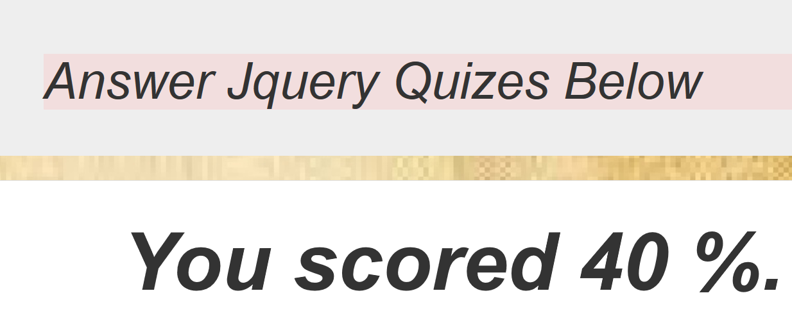

# Jquery Quiz
## Answer The quiz By Selecting A Button
### **Henry Halkano**
### Description
This application calculates the total percentage of the correct quizes selected out of  the total quiz attempted.
## Behavior Driven Development
* The program should return an alert when none of the radio buttons has been checked:

     **Example**: Please answer question 1 to proceed!

## /*Back-end logic*/
var inputedAnswers = [],
    scoredPoints = 0;
    questions = ["a-1", "b-2", "c-3", "d-4"];

function pointsCompiler(){
  scoredPoints = inputedAnswers[0] + inputedAnswers[1] + inputedAnswers[2] + inputedAnswers[3];
  return points;
}
/*Front-end logic*/
$(document).ready(function(){
  $(".question").hide();

## license & copyrite.
(c) 2018 Henry Halkano, Moringa school of programming
license under the[MIT license] (LICENSE)
